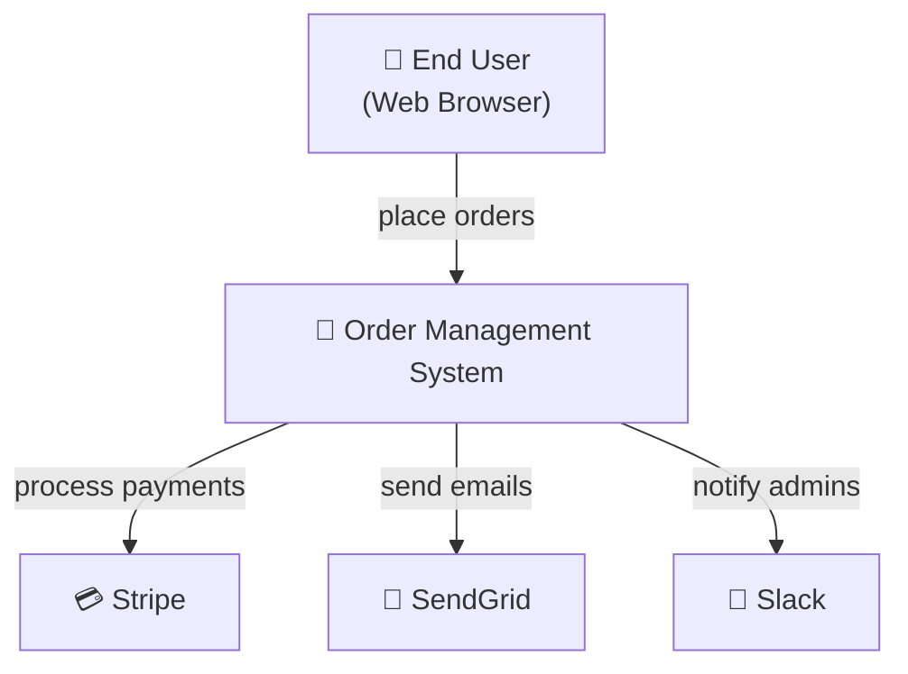
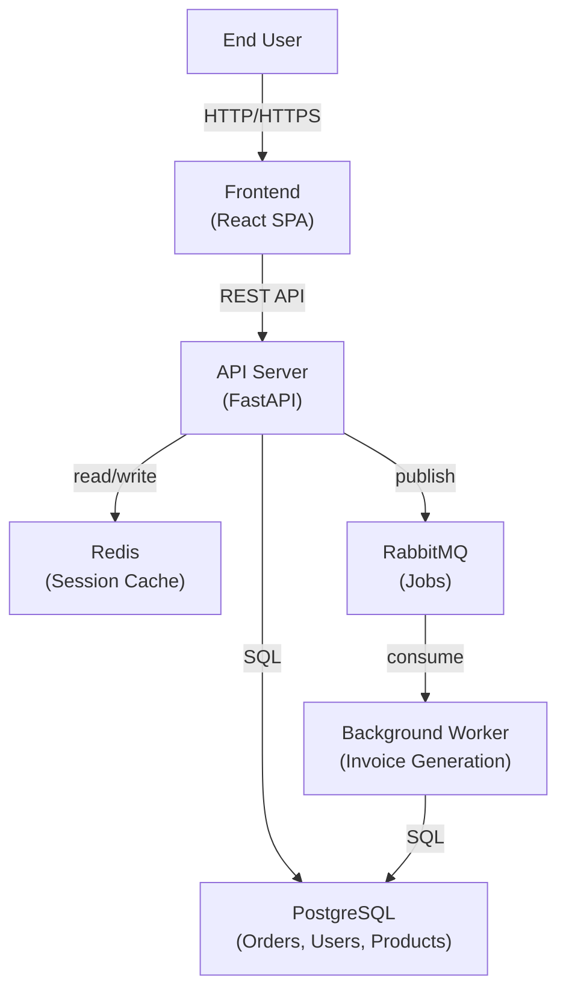
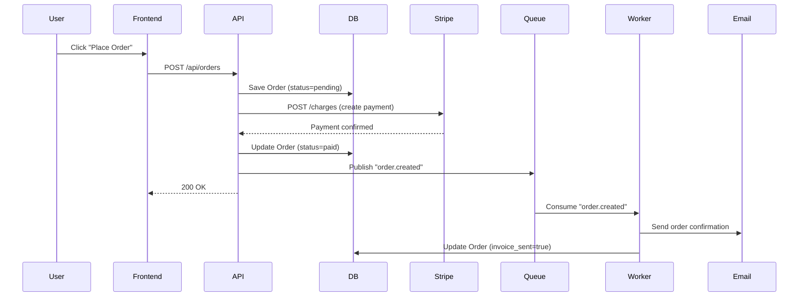
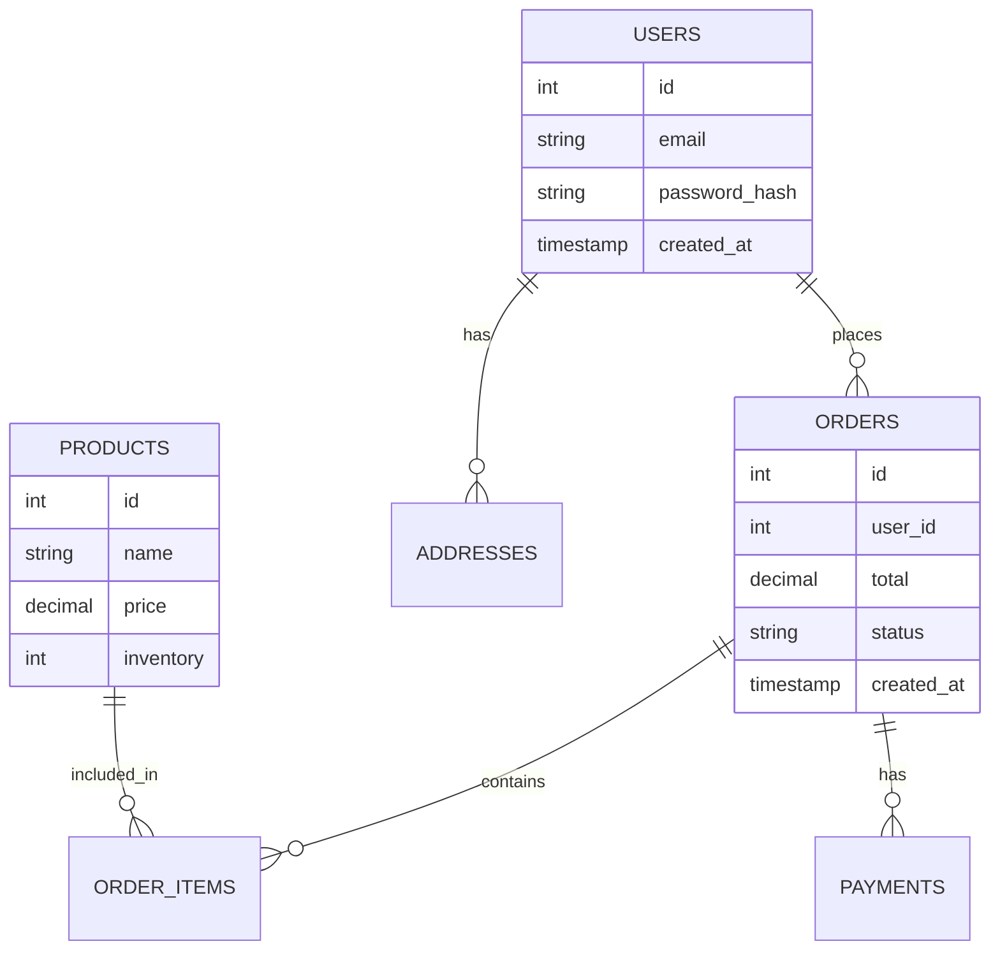
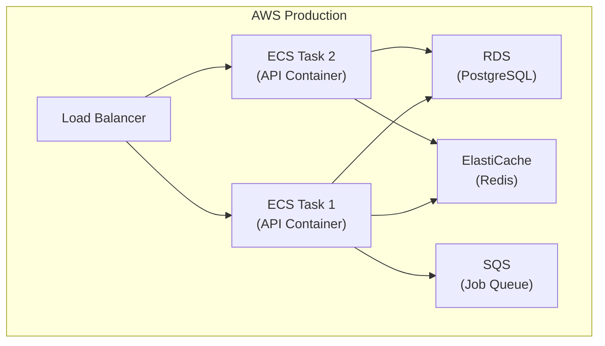

# Describe Design: Document Existing Systems

This skill researches existing codebases and produces architectural documentation with diagrams explaining how the system actually works. Unlike design-focused skills, this documents WHAT IS, not what should be.

**Best for:** Python/FastAPI + PostgreSQL full-stack apps, but works with any architecture.
**Output:** Diagrams, system overview, component guides, data flow docs, onboarding guide.

---

## Discovery Methodology

Follow this 8-step process to understand any codebase:

### Step 1: Project Configuration
Read foundational files first:
- `pyproject.toml` / `setup.py` / `requirements.txt` — Python dependencies
- `package.json` — Node/JavaScript context
- `docker-compose.yml` — Services, databases, networks
- `.env.example` / `config/` — Configuration structure
- `Dockerfile` — Build, runtime environment
- `.github/workflows/` — CI/CD tells you build flow, test strategy

**What to extract:** Main dependencies, runtime environment, external services (database, Redis, etc.), build/deploy approach.

### Step 2: Entry Points & Routing
Find how requests enter the system:
- Python: `main.py`, `app.py`, `src/main.py` → FastAPI/Flask router
- Node: `server.js`, `index.ts`, entry in `package.json` → Express/Next routes
- Find all route handlers: `@app.get()`, `@app.post()`, route files

**What to extract:** HTTP endpoints, which handlers serve them, URL patterns and their purposes.

### Step 3: Domain Boundaries
Map the file structure to understand responsibilities:
- List all major directories: `src/`, `app/`, `services/`, `models/`, `api/`, `db/`
- Identify layers: API routes, business logic, data access
- Find domain-driven directories: `users/`, `orders/`, `payments/`

**What to extract:** Module names, their roles, what they're responsible for.

### Step 4: Key User Flows (End-to-End)
Pick 2-3 critical workflows and trace them completely:

Example: "User clicks 'Create Order'" →
1. POST `/api/orders` hits route handler
2. Route handler calls `OrderService.create()`
3. Service validates input, calls `OrderRepository.save()`
4. Repository executes SQL INSERT on `orders` table
5. Triggers webhook to payment service
6. Response returned to frontend

Read actual code files. Trace imports. Follow function calls. **Every claim should cite a file path.**

**What to extract:** Request → middleware → service → database → response path. Error handling. Side effects (events, webhooks, async jobs).

### Step 5: Data Models & Relationships
Examine data layer:
- Find `models/` or `schemas/` directory
- Read ORM definitions (SQLAlchemy, Django ORM, Prisma)
- Identify tables: users, orders, products, payments
- Map relationships: foreign keys, many-to-many, one-to-many
- Look for enums, validation rules

**What to extract:** Entity names, fields, types, relationships, constraints.

### Step 6: External Integrations
Identify what the system talks to:
- Database: type, tables, role
- Cache: Redis, memcached
- Message queues: RabbitMQ, Kafka, SQS
- APIs: Stripe, SendGrid, AWS services
- File storage: S3, GCS, local filesystem
- Search: Elasticsearch, Algolia

**What to extract:** Service name, purpose, data exchanged, criticality (required vs. optional).

### Step 7: Deployment Configuration
Review how system runs in production:
- `docker-compose.yml` → local development topology
- Kubernetes files (`k8s/`) or IaC (`terraform/`, `CloudFormation`)
- `.github/workflows/` → build steps, tests, deployment steps
- Environment variables → configuration differences (dev vs. prod)

**What to extract:** Service topology, scaling patterns, secrets management, deployment pipeline.

### Step 8: Synthesize Documentation
Create 5 output documents (see below).

---

## Synthesis & Judgment: From Data to Insight

After collecting the raw data (steps 1-7), your job is to synthesize it into documentation that reveals how the system *actually works* — and what that means for developers and stakeholders. This is where you separate noise from signal.

### How to Identify Architecturally Interesting Flows

Not every code path matters. Focus on these:

**Critical user-facing flows:**
- What happens when a user does the primary job (place order, authenticate, query data)?
- Trace it end-to-end: entry point → middleware → business logic → database → response
- Include error paths (what if payment fails? What if database is down?)

**Integration points (where this system talks to others):**
- External API calls (Stripe, SendGrid, S3)
- Database connections, query patterns
- Message queues, event publishing
- Cache layers, invalidation logic
- These are coupling hotspots; they matter for understanding dependencies

**Data movement:**
- Where does data come in? How does it flow? Where does it go?
- Are there consistency windows (eventual consistency)? How are they handled?
- Does data have a clear source of truth, or is it scattered?

**What to ignore:**
- Utility functions and helpers (implementation detail, not architecture)
- Individual lines of code (unless they reveal a pattern)
- Minor variations in similar handlers (document the pattern once)
- Cosmetic refactoring history

### How to Judge When a C4 Diagram is "Done"

A C4 diagram is useful when:

1. **It answers one specific question.** Don't overload one diagram. "How does data flow?" is one diagram. "What are the system boundaries?" is another.

2. **A new engineer could explain it to a stakeholder.** If it requires 20 minutes of explanation, it's too complex. Simplify or split it.

3. **It's at the right zoom level.**
   - **Context Diagram**: Shows this system + external systems it depends on. That's it. If you're showing internal components here, zoom in to Container.
   - **Container Diagram**: Services, databases, message queues, caches. One box per deployable unit. If you're showing internals of a service, zoom in to Component.
   - **Component Diagram**: Modules within a service. Layers, domain boundaries. Don't show individual classes.

4. **It's honest about what you don't know yet.** If a component's internal structure is unclear, that's okay — document it as "TBD" and note what question needs answering. Don't invent structure.

5. **It fits on one screen** (or takes minimal scrolling). If you need to split it, split it.

Anti-patterns:
- Diagram with 40+ boxes: split into multiple diagrams or reduce detail
- Diagram with no labels on edges: readers can't understand data flow
- Diagram that mixes abstraction levels (services + classes + functions): choose one
- Diagram that's outdated: if you find inconsistencies, note them as "needs verification"

### What Makes Documentation Valuable

Documentation fails when it just *describes* code. ("UserService calls UserRepository which queries the users table.") It succeeds when it explains *why* the system is shaped that way and what that means.

Valuable documentation:

1. **Explains coupling, not just code.**
   - Bad: "The order service calls the inventory service"
   - Good: "Order service is tightly coupled to Inventory via synchronous REST calls (30ms latency per order). This means Inventory downtime blocks order placement. If scaling, note: Inventory becomes a bottleneck at 1000 RPS."

2. **Identifies hotspots and failure modes.**
   - "Auth service has 12 inbound dependencies. It's a coupling hotspot — any change requires coordinating with 3 teams. Consider whether all those dependencies are necessary."
   - "Payment processing is synchronous and must complete in <2s. At scale, this becomes the critical path. Current DB can handle 500 TPS; we hit that at ~100k daily users."

3. **Flags architectural debt explicitly.**
   - "Order and Inventory services share a database table (orders). This couples them at the data layer, prevents independent scaling. Recommendation: extract a new table for inventory reservations, owned by Inventory service."

4. **Explains trade-offs that were made.**
   - "We chose a shared database (simple to operate) over database-per-service (harder to operate but looser coupling). This works at current scale (100 RPS) but will need rethinking at 5x that scale."

5. **Provides a mental model, not just facts.**
   - Don't just list endpoints. Explain: "All requests flow through an API gateway (routing + auth). The gateway calls microservices in sequence (or parallel where possible). Services talk to a shared message queue for async work. This architecture works for us because we have independent scaling needs per domain."

### How to Extract Insights

After tracing the code, ask yourself:

**Coupling insights:**
- Which modules change together most frequently? (Strong coupling)
- If Service A changes, how many other services need changes?
- Are there "gateway" services that many others depend on? (Bottleneck)
- Are there circular dependencies?

**Data insights:**
- Which table gets queried most? (Potential index opportunity or schema redesign)
- Where is data duplicated? (Eventual consistency window? Or mistake?)
- Are there cross-table transactions? (Couples tables; consider splitting)
- What's the source of truth for each entity?

**Scale insights:**
- At 10x current load, what breaks first? (The critical path)
- What takes longest in the critical path?
- Where would you add caching? (After diagnosing the bottleneck)
- Which services can scale independently?

**Resilience insights:**
- If Service X goes down, what breaks?
- Are there sync chains that cascade failures? (Redesign to async)
- What gets retried? What can't be retried?
- Do you have timeouts on all external calls?

**Documentation insights:**
- Is there an explicit source of truth for each entity type?
- When code changes, where else breaks?
- Can new engineers find where to add a feature?
- Is the architecture decision history documented, or lost?

---

## Documentation Output Formats

### 1. System Overview Document
A narrative explanation of what the system does, not how it's built.

**Structure:**
```
## System Overview

### Purpose
What business problem does this solve? Who uses it? What are the main jobs to be done?
[2-3 sentences]

### Architecture at a Glance
Major components and their roles:
- Backend API (FastAPI)
- PostgreSQL database
- Stripe payment processor
- SendGrid email service
- Frontend SPA (React)

### Technology Stack
- Language: Python 3.11
- Framework: FastAPI
- Database: PostgreSQL 15
- Cache: Redis
- Message Queue: RabbitMQ
- Hosting: AWS (Docker on ECS)

### Key Workflows
Brief summary of main user journeys:
1. User registration → email verification → dashboard access
2. Create order → payment processing → order confirmation
3. Background jobs → invoice generation → email delivery

### External Dependencies
- **Stripe API** - Payment processing (critical)
- **SendGrid** - Email delivery (critical)
- **Slack** - Admin notifications (non-critical)

### Deployment Overview
- Production runs on AWS ECS with auto-scaling
- Database is managed RDS instance
- CI/CD via GitHub Actions (test → build → deploy)
```

### 2. Architecture Diagrams (Mermaid)

**C4 Context Diagram** (highest level, shows external systems):


**Container Diagram** (main services/components):


**Sequence Diagram** (example: create order flow):


**Entity-Relationship Diagram** (data models):


**Deployment Diagram** (production environment):


### 3. Component Deep-Dives
Per-module documentation with specific file references.

**Format:**
```
## UserService (`src/services/user_service.py`)

### Responsibility
Manages user account lifecycle: registration, authentication, profile updates.

### Public API
- `register(email, password)` → User | raises ValidationError
- `authenticate(email, password)` → str (JWT token)
- `get_profile(user_id)` → UserDTO
- `update_profile(user_id, data)` → UserDTO

### Key Design Decisions
- Uses SQLAlchemy ORM (models in `src/models/user.py`)
- Passwords hashed with bcrypt (utility in `src/utils/crypto.py`)
- JWT tokens expire in 24 hours
- Email verification required before account activation

### Dependencies
**Uses:**
- `src/repositories/user_repository.py` — database queries
- `src/utils/crypto.py` — hashing, token generation
- `src/schemas/user.py` — request/response validation

**Used By:**
- `src/routes/auth.py` — HTTP handlers for registration, login
- `src/routes/users.py` — profile endpoints

### Error Handling
- `UserNotFound` (404) — if user doesn't exist
- `InvalidCredentials` (401) — password mismatch
- `EmailAlreadyExists` (409) — registration duplicate email
```

### 4. Data Flow Documentation
Request lifecycle and event flows.

**HTTP Request Lifecycle:**
```
POST /api/orders →
  1. FastAPI receives request
  2. Middleware: validate JWT token (auth.py:verify_token)
  3. Route handler: orders.py:create_order()
  4. Service layer: OrderService.create() (services/order.py)
  5. Validation: schemas.OrderCreate schema
  6. Repository: OrderRepository.save() (repositories/order.py)
  7. ORM executes: INSERT INTO orders (models/order.py)
  8. Trigger: Queue publish for "order.created" event
  9. Response: return OrderDTO (201 Created)
```

**Event Flow (Async Jobs):**
```
Event: order.created →
  Published by: OrderService.create() (after DB commit)
  Queue: RabbitMQ topic "orders"
  Consumer: BackgroundWorker (workers/order_worker.py)
  Steps:
    1. Fetch Order from DB
    2. Generate invoice PDF
    3. Send email via SendGrid
    4. Record in audit log
  Error handling: Retry 3x, then send admin alert
```

### 5. Onboarding Guide
For new engineers getting up to speed.

**Format:**
```
## Getting Started

### Local Setup (15 minutes)
1. Clone repo: `git clone ...`
2. Install deps: `pip install -r requirements.txt`
3. Create `.env` from `.env.example`
4. Start services: `docker-compose up -d`
5. Run migrations: `alembic upgrade head`
6. Start server: `uvicorn src.main:app --reload`
7. Visit http://localhost:8000/docs (API docs)

### Key Files to Read First
1. `src/main.py` — FastAPI app initialization
2. `src/routes/` — HTTP endpoints (start with one endpoint)
3. `src/services/` — business logic
4. `src/models/` — SQLAlchemy ORM models
5. `docker-compose.yml` — services topology

### Common Workflows
**Running tests:** `pytest tests/`
**Creating a migration:** `alembic revision -m "add column"`
**Adding an endpoint:**
  1. Create route in `src/routes/`
  2. Add service method in `src/services/`
  3. Add repository method in `src/repositories/`
  4. Write tests in `tests/`

### Where to Find Things
- Routes → `src/routes/`
- Business logic → `src/services/`
- Database queries → `src/repositories/`
- Data validation → `src/schemas/`
- ORM models → `src/models/`
- Tests → `tests/`
- Configuration → `.env`, `config.py`

### Understanding a Request
Pick any endpoint (e.g., `/api/orders/{id}`):
1. Find route: `src/routes/orders.py` → `@app.get("/orders/{id}")`
2. See it calls: `OrderService.get_by_id(id)`
3. Find service: `src/services/order.py`
4. See it calls: `OrderRepository.get_by_id(id)`
5. Find repository: `src/repositories/order.py`
6. See the SQL query being built
7. Check the ORM model: `src/models/order.py` for columns/relationships

### Getting Help
- API docs: http://localhost:8000/docs
- Search codebase: Look for function/class names
- Read tests: `tests/test_*.py` show usage examples
- Check git log: `git log --oneline src/feature` shows recent changes
```

---

## Key Principles

✓ **Read the code, never guess** — Every claim must cite specific file paths
✓ **Document what IS, not what should be** — Describe actual architecture
✓ **Start broad, zoom in** — Context diagram → containers → components
✓ **Make it useful** — Onboarding = fast time-to-first-commit
✓ **Use Mermaid everywhere** — Renders in GitHub, VS Code, Confluence
✓ **Keep diagrams focused** — One concept per diagram, fit on screen
✓ **Cite code paths** — "See `src/services/order.py` line 42"

---

## When to Use This Skill

- You're onboarding a new engineer to an unfamiliar codebase
- You need to explain architecture to non-technical stakeholders
- You've inherited a system and need to understand it
- You're documenting code for compliance/audit purposes
- You want to identify architectural debt or coupling
- You're preparing for a system redesign and need current-state docs

---

## Output Checklist

After running this skill, you should have:
- [ ] System overview document (1-2 pages)
- [ ] C4 context diagram (what the system does from outside)
- [ ] Container diagram (main services)
- [ ] Sequence diagram (2-3 key flows)
- [ ] Entity-relationship diagram (data model)
- [ ] 3-4 component deep-dives (core modules)
- [ ] Data flow guide (request lifecycle)
- [ ] Onboarding guide (new engineer's first day)

All diagrams in Mermaid, all code citations with file paths, all formatted for markdown docs.
